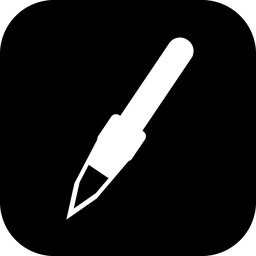
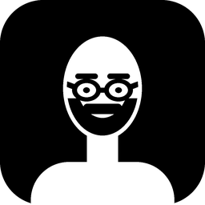

# RoDraw

Draw and write straight onto your screen so a class can see exactly where to
look. Annotations float above every other program, so it works over slides, a
browser, a PDF, code — anything.




## What it does

- **Draw and write in colour** — pen, highlighter, straight lines, arrows,
  rectangles, ellipses and text, in eight colours you can change.
- **Zoom to a region** — drag a box around anything and it fills the screen,
  so the back row can read it. Scroll to adjust, middle-drag to pan. It only
  magnifies **the monitor you drew the box on**.
- **Sleep mode** — one button makes RoDraw click-through. Your annotations
  stay on screen but every click and drag goes to the program underneath.
  Press it again to carry on drawing.
- **Spotlight** — dim everything except one circle. Clicks still reach your
  apps while it is on, so you can scroll the page you are pointing at.
- **Select and move** — doubles as a normal cursor: clicks pass through to
  your apps over empty screen, and pick up an annotation when you are over
  one.
- **Per-monitor** — choose which screens RoDraw draws on, and leave the
  others completely alone.
- **Whiteboard / blackboard** — a plain background to write on.
- **Save or copy** the screen with your annotations burned in.
- **Resize and turn an annotation** — pick one up with the select tool and
  it gets handles: eight on the dashed box, and a round one above it that
  turns the thing. Corners keep the proportions, edges stretch one way.
- **Made for interactive whiteboards** — a touch layout with larger buttons
  that switches itself on when Windows reports a touch screen, a size
  setting from 60% to 220%, and a compact block shape for the toolbar so it
  can sit in a corner within reach of a shorter pupil.
- **Every shortcut is rebindable** in Settings → Keybinds.
- **10 languages**, chosen in Settings → General and in the installer.
- **Mix your own colours** — double-click any swatch for a gradient picker,
  hex box and the colours you have used before.

## Languages

English by default, Bulgarian second, then German, Spanish, French, Italian,
Portuguese (Brazil), Russian, Turkish and Ukrainian.

Pick one in **Settings → General**; the toolbar, menus and on-screen messages
change straight away, and the settings window itself follows when you reopen
it. The installer asks separately, and on a **first** install it starts RoDraw
in the language you installed in — a reinstall never overwrites a choice you
already made.

A language only appears in the list once a translation for it actually
exists, so nothing is offered that would quietly show English. Anything a
translation has not filled in falls back to English rather than showing a
blank: at the moment that is only the About tab text outside English and
Bulgarian.

Adding a language is one file: copy `rodraw/lang/bg.py`, translate the
values, and add its code to `CODES` in `rodraw/lang/__init__.py` and to
`ORDER`/`NAMES` in `rodraw/i18n.py`. Because the tables are imported
dynamically, new codes must also be listed in the `hiddenimports` of
`build/RoDraw.spec`, or the packaged build will ship without them.

## Installing

Run `RoDraw Setup.exe`.

It installs **just for you by default**, so it does not need an administrator
password — handy on a school machine. If you do have admin rights you can
choose an all-users install in the wizard.

RoDraw then sits in the notification area next to the clock. Click that icon
any time to sleep or wake it.

## Sleep mode — the important one

RoDraw covers the whole screen, so while it is awake it catches every click.
**Press `F8`** and it goes to sleep: it stops catching anything, the toolbar
hides, and you can use your PC completely normally. Press `F8` again to wake
it and carry on drawing where you left off.

`F8` is registered system-wide, which is why it still works while another
program has focus. You can change it in **Settings → General**. Function keys
and combinations like `Ctrl+Alt+D` are the safest picks — a plain letter would
be taken away from every other program on the PC.

If something else already owns your chosen key, RoDraw says so on screen and
keeps working; just pick another one.

Going to sleep drops out of zoom and off a whiteboard, because both of those
paint over the whole screen — leaving one up while your clicks pass through
would hide the very thing you were trying to click. **Your drawings and your
undo history are kept**, so waking up puts you right back where you were.

## Default shortcuts

These work whenever RoDraw is awake. All of them can be changed in
**Settings → Keybinds**.

### Tools
| Key | Tool |
|-----|------|
| `V` | Select / move — also works as a normal cursor (see below) |
| `P` | Pen |
| `H` | Highlighter |
| `E` | Eraser — rubs out the part you pass over |
| `L` | Line |
| `A` | Arrow |
| `R` | Rectangle |
| `O` | Ellipse |
| `T` | Text |
| `X` | Spotlight |
| `Z` | Zoom to region |

### Editing
| Key | Action |
|-----|--------|
| `Ctrl+Z` | Undo |
| `Ctrl+Y` / `Ctrl+Shift+Z` | Redo |
| `Ctrl+D` | Clear everything |
| `Del` | Delete the selected item |
| `Ctrl+S` | Save a screenshot to `Pictures\RoDraw` |
| `Ctrl+C` | Copy a screenshot to the clipboard |

### View
| Key | Action |
|-----|--------|
| `+` / `-` | Zoom in / out |
| `0` | Reset zoom |
| `F5` | Refresh the frozen zoom image |
| `W` | Whiteboard background |
| `B` | Blackboard background |
| `Esc` | **Quick exit** — out of zoom, a board and any pointing tool |

### Everything else
| Key | Action |
|-----|--------|
| `1`–`8` | Pick colour slot 1–8 |
| `[` / `]` | Smaller / bigger brush |
| `Tab` | Show or hide the toolbar |
| `Ctrl+,` | Settings |
| `Ctrl+Q` | Quit |
| `F8` | **Sleep / wake** (works even when asleep) |

### Mouse
| Action | Result |
|--------|--------|
| Scroll | Brush size — or **moves the view while zoomed**, or spotlight size |
| `Ctrl`+scroll | Magnification, while zoomed |
| `Shift`+scroll | Moves a zoomed view sideways |
| Middle-drag | Pan a zoomed view |
| Hold `Shift` | Snap lines to 45°, make squares and circles |

## Two monitors

Each screen gets its own overlay, so they stay independent:

- **Zoom only magnifies the screen you drew the box on.** The other monitor
  carries on showing what it was showing.
- **Whiteboard / blackboard applies to one screen**, whichever the mouse is on.
- **You can switch a screen off entirely** — the monitors button in the
  toolbar (or *Screens…* in the tray menu) lists them. An unticked screen
  stops taking the mouse completely, so you can read, scroll and click over
  there while annotating on the other one. At least one screen always stays on.

Undo is shared across screens: `Ctrl+Z` takes back the last thing you drew,
wherever you drew it.

## Zoom, in detail

Press `Z` and drag a box around what you want to enlarge. RoDraw takes a
picture of the screen and magnifies that region to fill the display, with your
annotations scaled along with it. You can keep drawing while zoomed, and the
strokes land in the right place when you zoom back out.

Once magnified, **the scroll wheel moves the view** — up and down on its own,
sideways with `Shift`, and `Ctrl`+scroll changes the magnification. That works
with whatever tool is in your hand, so you can annotate and navigate without
swapping back to the zoom tool. Middle-drag still pans too.

The spotlight and select make the overlay click-through, so no scroll
event is ever delivered to RoDraw. While a view is magnified it watches the
wheel system-wide and swallows the scroll — the screen underneath is frozen
anyway — and hands the wheel straight back the moment you zoom out.

Because it is working from a still picture, live content underneath (a playing
video, a scrolling page) will not update while zoomed — press `F5` to take a
fresh picture, or `Esc` to come back out.

## Escape

`Esc` is the way out of anything that has taken the screen over. One press
drops the zoom, clears a whiteboard, deselects, and puts a pointing tool back
to the pen — including a zoom left running on your *other* monitor. If you
are midway through a stroke or dragging a zoom box, the first press abandons
just that, so it never throws away a zoom you wanted to keep.

It works no matter which RoDraw window Windows currently considers active —
it used to stop responding as soon as you clicked a tool on the toolbar,
because the toolbar became the active window and the key never reached the
drawing surface.

While a screen is actually covered — zoomed or on a board — RoDraw claims
`Esc` system-wide so there is always a way out. The moment nothing is
covered it gives the key straight back, so `Esc` stays an ordinary key for
everything else on your PC.

## The select tool

`V` doubles as an ordinary mouse pointer. Over empty screen it is
click-through, so clicks, drags and scrolls reach the app underneath exactly
as if RoDraw were not running. Move over one of your own annotations and it
lights up with a dashed outline — now a click picks it up, a drag moves it,
and `Delete` removes it.

Windows decides hit-testing per window rather than per click, so this has to
be settled *before* the button goes down: RoDraw follows the cursor and makes
the overlay solid only while it is over something of yours.

One consequence: clicking another program gives it the keyboard focus, so the
single-key shortcuts stop responding until you click back. The toolbar still
works, and the sleep key is system-wide, so both always reach RoDraw.

## Colours

The eight swatches are the palette; `1`–`8` pick them while drawing.

**Double-click a swatch** to open the picker: a saturation/brightness
gradient with a hue bar, a hex box for an exact value, and the colours you
have mixed before. Hovering the colours makes the toolbar say so, since a
double-click is not something you would guess at.

*Reset the eight colours to their defaults* puts the original palette back
**without touching the recently-used list**, so a favourite you mixed is
never lost by swapping a slot.

## The spotlight

`X` dims everything except a circle. Resize it with the **scroll wheel** or
by typing into the **Size** box — both drive the same number and it is
remembered between sessions.

The spotlight is click-through, so no wheel event is ever delivered to
RoDraw. It watches the wheel system-wide for exactly as long as that tool is
active, and swallows the scroll so the page underneath holds still while you
resize.

## The eraser

The eraser rubs out only what it passes over, splitting a long stroke into the
parts you left behind. Shapes, arrows and text cannot be half-rubbed-out, so
those go whole when touched. If you would rather one touch removed an entire
stroke, tick *Eraser removes a whole stroke* in **Settings → Drawing**.

## Where things are kept

| What | Where |
|------|-------|
| Settings and keybinds | `%APPDATA%\RoDraw\settings.json` |
| Saved screenshots | `Pictures\RoDraw\` |

Deleting `settings.json` resets RoDraw to its defaults.

## Building it yourself

Requires Python 3.10+ on Windows.

```powershell
pip install -r requirements.txt
powershell -ExecutionPolicy Bypass -File build\build.ps1
```

The installed program is just `RoDraw.exe` beside a `RoDraw` folder holding
Qt, Python and the uninstaller — PyInstaller would otherwise call that folder
`_internal`, which looks alarming in a program you just installed.

That regenerates both marks, builds `dist\RoDraw\RoDraw.exe`, smoke-tests it,
and — if Inno Setup 6 is installed — builds the installer in
`installer\Output\`.

The smoke test (`tools/smoke_test.py`) launches the built exe and checks the
windows it puts on screen: a crash dialog fails the build, and so does never
getting a window titled `RoDraw`. It exists because a build once shipped with
an import error at startup — checking only "is the process still alive?" was
not enough, since PyInstaller's crash dialog keeps the process alive. A failed
smoke test stops the build before the installer is packaged.

To build only the application:

```powershell
powershell -ExecutionPolicy Bypass -File build\build.ps1 -SkipInstaller
```

Inno Setup, if you want the installer:

```powershell
winget install -e --id JRSoftware.InnoSetup
```

To run from source without building:

```powershell
python -m rodraw
```

### The two marks

`tools/make_icon.py` draws both in code and writes every size.

| File | What it is |
|------|-----------|
| `rodraw/resources/rodraw.ico` | **App icon** — a white brush with its tip in black ink. Used for the exe, the installer, the tray and the window icon. |
| `rodraw/resources/logo.ico` | **House mark** — a minimal portrait. Shown on the About tab. |

```powershell
python tools\make_icon.py --preview
```

`--preview` also writes `icon_preview.png` showing both at 16, 24, 32, 48 and
64 px, which is worth checking — a mark that reads well at 256 px can turn to
mush in the taskbar.

Both are white on a black tile. Any black detail that touches the figure's
outline merges into the tile and destroys the silhouette — a black beard
against a black background simply eats the head — so a thin white rim is
painted back over the edge. That is why the beard and the inked tip have a
bright outline.

## Licence

GPL-3.0-or-later. The full text is in [LICENSE](LICENSE).

In short: use it, change it, pass it on, sell it if you like — but anything
you hand to someone else that is built on this has to come with its source
under the same terms. Nobody gets to take it closed.

RoDraw is built on PyQt6, which is itself GPL-3.0.

## Layout

| File | Purpose |
|------|---------|
| `rodraw/overlay.py` | The full-screen drawing surface, sleep mode, zoom |
| `rodraw/model.py` | Shapes, rendering and undo/redo |
| `rodraw/toolbar.py` | The floating tool palette |
| `rodraw/settings_dialog.py` | Settings, including the keybinds tab |
| `rodraw/config.py` | Defaults and saved settings |
| `rodraw/hotkeys.py` | System-wide sleep/wake key |
| `rodraw/capture.py` | Screen capture for zoom and saving |
| `rodraw/winutil.py` | Click-through, startup entry, single instance |
| `rodraw/icons.py` | Toolbar glyphs, drawn in code |
| `rodraw/colordialog.py` | The colour picker: gradient, hex, history |
| `rodraw/i18n.py` | Translation lookup and the language list |
| `rodraw/lang/` | One string table per language |
| `rodraw/assets.py` | Finding bundled resources in a build |
| `tools/make_icon.py` | Generator for the app icon and the house mark |
| `tools/smoke_test.py` | Post-build check that the exe really starts |

What is **not** in the repository: `dist\`, `installer\Output\` and
`build\work\`. All three are produced by `builduild.ps1` from what is
here, and together they come to about 160 MB.
